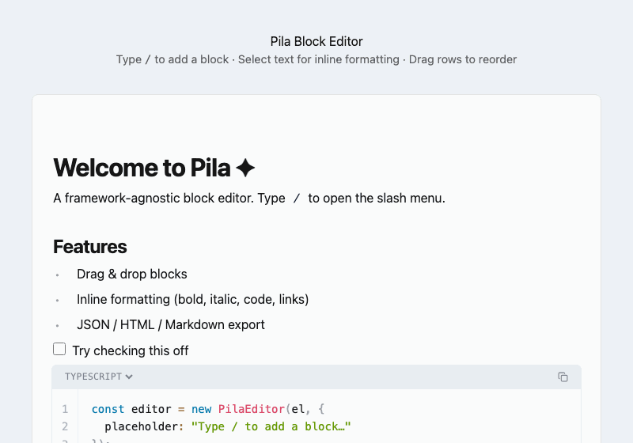

# Pila

**Pieces of Information, Linked and Arranged** — a framework-agnostic, Notion-style block editor written in TypeScript.

Pila is built on plain Web Components and requires no framework. It works in vanilla HTML as well as React, Vue, Svelte, or any other environment that can provide a DOM element.



---

## Features

- **Block-based editing** — paragraphs, headings, lists, todos, code, quotes, callouts, dividers, images, tables, and multi-column layouts
- **Inline formatting** — bold, italic, underline, inline code, links via floating toolbar or keyboard shortcuts
- **Slash menu** — type `/` to insert any block type
- **Drag & drop** — drag the handle beside any block to reorder
- **Syntax highlighting** — code blocks with Prism.js (14 languages)
- **Export** — JSON, HTML, Markdown, and **Email HTML** serializers built in
- **Plugin API** — register custom block types, slash-menu items, and toolbar buttons
- **Framework-agnostic** — pure DOM / Web Components, no React/Vue/Svelte dependency
- **TypeScript** — full type declarations included

---

## Installation

```bash
npm install @sunacchi/pila
```

Import the CSS once in your app entry point:

```ts
import '@sunacchi/pila/styles'
```

---

## Quick Start

```ts
import { PilaEditor } from '@sunacchi/pila'
import '@sunacchi/pila/styles'

const editor = new PilaEditor(document.getElementById('editor'), {
  placeholder: 'Type / to add a block…',
  initialContent: [
    { id: '1', type: 'heading1', content: [{ text: 'Hello, Pila!' }] },
    { id: '2', type: 'paragraph', content: [{ text: 'Start writing…' }] },
  ],
  onChange(blocks) {
    console.log('content changed', blocks)
  },
})

editor.mount()
```

Call `editor.destroy()` when the editor is no longer needed to clean up event listeners and DOM nodes.

---

## API

### `new PilaEditor(container, options?)`

| Parameter   | Type          | Description                         |
|-------------|---------------|-------------------------------------|
| `container` | `HTMLElement` | The DOM element to mount inside     |
| `options`   | `EditorOptions` | Optional configuration (see below) |

### `EditorOptions`

| Property         | Type                        | Description                                             |
|------------------|-----------------------------|---------------------------------------------------------|
| `placeholder`    | `string`                    | Placeholder text shown in an empty first paragraph      |
| `initialContent` | `Block[]`                   | Pre-populate the editor with content                    |
| `onChange`       | `(blocks: Block[]) => void` | Called whenever blocks change                           |
| `plugins`        | `PilaPlugin[]`              | Plugins to install on mount                             |

### Methods

| Method                   | Returns  | Description                              |
|--------------------------|----------|------------------------------------------|
| `mount()`                | `void`   | Renders the editor into the container   |
| `destroy()`              | `void`   | Unmounts and cleans up all resources    |
| `getContent('json')`     | `string` | Serializes blocks to a JSON string      |
| `getContent('html')`     | `string` | Serializes blocks to HTML               |
| `getContent('markdown')` | `string` | Serializes blocks to Markdown           |
| `getContent('email')`    | `string` | Serializes blocks to a standalone email-safe HTML document |

---

## Content Model

All content is represented as an array of `Block` objects:

```ts
interface Block {
  id: string
  type: BlockType
  content?: InlineNode[]   // rich-text content
  attrs?: BlockAttrs       // block-specific attributes
}
```

### `InlineNode`

```ts
interface InlineNode {
  text: string
  bold?: boolean
  italic?: boolean
  underline?: boolean
  code?: boolean
  link?: string
}
```

See [src/blocks/README.md](src/blocks/README.md) for a full description of every block type and its schema.

---

## Export Formats

### JSON

Returns the internal `Block[]` array as a JSON string. This is the canonical format for saving and restoring content.

```ts
const json = editor.getContent('json')
// Store it, then restore later:
new PilaEditor(el, { initialContent: JSON.parse(json) })
```

### HTML

Returns clean semantic HTML (`<p>`, `<h1>`–`<h3>`, `<ul>`, `<ol>`, `<blockquote>`, `<pre><code>`, `<table>`, etc.). Intended for rendering/display elsewhere — HTML **cannot** be fed back into the editor.

### Markdown

Returns standard Markdown. ATX headings, fenced code blocks with language labels, GFM tables, and task-list checkboxes are supported.

### Email HTML

Returns a complete `<!DOCTYPE html>` document suitable for sending as an HTML email. All styles are inlined (no `<style>` blocks), column layouts use `<table role="presentation">`, and client-specific quirks (Outlook conditional comments, `mso-` properties) are included. The output cannot be fed back into the editor.

```ts
const emailHtml = editor.getContent('email')
// pass to your email-sending SDK, e.g. nodemailer, SendGrid, etc.
```

Callout flavour colours, todo checkboxes (☐ / ☑), code blocks, and all inline marks are fully supported.

---

## Theming

Pila exposes every visual token as a CSS custom property. Override them on `:root` (global) or scope them to a specific container to theme individual editor instances.

```css
/* global dark theme */
:root {
  --pila-bg:   #1e1e1e;
  --pila-text: #d4d4d4;
  --pila-border: #3a3a3a;

  --pila-code-bg:   #2d2d2d;
  --pila-code-text: #cdd6f4;

  --pila-toolbar-bg:   #2d2d2d;
  --pila-toolbar-text: #f8f8f8;

  --pila-slash-bg:       #2d2d2d;
  --pila-slash-border:   #3a3a3a;
  --pila-slash-hover:    #3a3a3a;
  --pila-slash-selected: #1e3a5f;
}
```

### Full variable reference

#### Typography

| Variable | Default | Description |
|---|---|---|
| `--pila-font` | system-ui / `-apple-system` stack | Base font family |
| `--pila-mono` | `'Fira Code'` / `Consolas` stack | Monospace font for code blocks |

#### Colors

| Variable | Default | Description |
|---|---|---|
| `--pila-bg` | `#ffffff` | Editor background |
| `--pila-text` | `#1a1a1a` | Primary text |
| `--pila-muted` | `#9b9b9b` | Secondary / muted text |
| `--pila-placeholder` | `#c4c4c4` | Empty block placeholder |
| `--pila-accent` | `#2563eb` | Links and selected state |
| `--pila-accent-hover` | `#1d4ed8` | Accent hover state |
| `--pila-border` | `#e2e8f0` | Borders and dividers |
| `--pila-radius` | `6px` | Border radius for menus and modals |
| `--pila-shadow` | `0 4px 24px rgba(0,0,0,.10)` | Floating element shadow |

#### Code blocks

| Variable | Default | Description |
|---|---|---|
| `--pila-code-bg` | `#f1f5f9` | Fenced code block background |
| `--pila-code-text` | `#0f172a` | Fenced code block text |
| `--pila-inline-code-bg` | `#f1f5f9` | Inline `code` background |
| `--pila-inline-code-text` | `#0f172a` | Inline `code` text |

#### Callout flavours

Each callout flavour (`info`, `warning`, `error`, `success`, `tip`) has three tokens:

| Variable pattern | Description |
|---|---|
| `--pila-callout-{flavour}-bg` | Background fill |
| `--pila-callout-{flavour}-border` | Left accent border |
| `--pila-callout-{flavour}-text` | Text colour |

```css
/* Example: custom "info" callout */
:root {
  --pila-callout-info-bg:     #e0f2fe;
  --pila-callout-info-border: #0284c7;
  --pila-callout-info-text:   #0c4a6e;
}
```

#### Quote block

| Variable | Default | Description |
|---|---|---|
| `--pila-quote-border` | `#94a3b8` | Left border colour |
| `--pila-quote-text` | `#4b5563` | Quote text colour |

#### Floating toolbar

| Variable | Default | Description |
|---|---|---|
| `--pila-toolbar-bg` | `#1e1e1e` | Toolbar background |
| `--pila-toolbar-text` | `#f8f8f8` | Toolbar icon / text colour |

#### Slash menu

| Variable | Default | Description |
|---|---|---|
| `--pila-slash-bg` | `#ffffff` | Menu background |
| `--pila-slash-border` | `#e2e8f0` | Menu border |
| `--pila-slash-hover` | `#f1f5f9` | Item hover background |
| `--pila-slash-selected` | `#eff6ff` | Keyboard-selected item background |

---

## Framework Integration

Pila only needs a real `HTMLElement`. Call `mount()` after the element is in the DOM and `destroy()` before it is removed.

### Vue

```vue
<template>
  <div ref="editorEl" />
</template>

<script setup lang="ts">
import { ref, onMounted, onBeforeUnmount } from 'vue'
import { PilaEditor } from '@sunacchi/pila'
import '@sunacchi/pila/styles'

const editorEl = ref<HTMLElement | null>(null)
let editor: PilaEditor | null = null

onMounted(() => {
  editor = new PilaEditor(editorEl.value!, { placeholder: 'Type / to add a block…' })
  editor.mount()
})

onBeforeUnmount(() => editor?.destroy())
</script>
```

### React

```tsx
import { useEffect, useRef } from 'react'
import { PilaEditor } from '@sunacchi/pila'
import '@sunacchi/pila/styles'

export function Editor() {
  const ref = useRef<HTMLDivElement>(null)
  const editorRef = useRef<PilaEditor | null>(null)

  useEffect(() => {
    editorRef.current = new PilaEditor(ref.current!, { placeholder: 'Type / to add a block…' })
    editorRef.current.mount()
    return () => editorRef.current?.destroy()
  }, [])

  return <div ref={ref} />
}
```

### Svelte

```svelte
<script lang="ts">
  import { onMount, onDestroy } from 'svelte'
  import { PilaEditor } from '@sunacchi/pila'
  import '@sunacchi/pila/styles'

  let el: HTMLDivElement
  let editor: PilaEditor

  onMount(() => {
    editor = new PilaEditor(el, { placeholder: 'Type / to add a block…' })
    editor.mount()
  })

  onDestroy(() => editor?.destroy())
</script>

<div bind:this={el} />
```

---

## Plugin API

A plugin is an object with a `name` string and an `install(api)` function.

```ts
import type { PilaPlugin } from '@sunacchi/pila'

const myPlugin: PilaPlugin = {
  name: 'my-plugin',
  install(api) {
    // Register a custom block type
    api.registerBlockType({
      type: 'my-block',
      factory(block) {
        const el = document.createElement('div')
        el.textContent = 'My custom block!'
        return el
      },
      slashItem: {
        name: 'My Block',
        description: 'Insert a custom block',
        icon: '🔧',
      },
    })

    // Add a toolbar button
    api.addToolbarButton({
      label: 'Hi',
      title: 'Say hi',
      command() { alert('Hello from plugin!') },
    })

    // Subscribe to editor events
    api.on('blocks:change', ({ blocks }) => {
      console.log('blocks changed', blocks)
    })
  },
}

const editor = new PilaEditor(el, { plugins: [myPlugin] })
editor.mount()
```

### `PilaPluginAPI`

| Member                             | Description                                            |
|------------------------------------|--------------------------------------------------------|
| `editorEl`                         | Root editor DOM element                                |
| `manager`                          | `BlockManager` — read/write access to block state      |
| `registerBlockType(descriptor)`    | Register a custom block type with an optional slash item |
| `addToolbarButton(descriptor)`     | Add a button to the floating formatting toolbar        |
| `on(event, handler)`               | Subscribe to editor events; returns an unsubscribe fn  |

### Editor Events

| Event            | Payload                              |
|------------------|--------------------------------------|
| `block:add`      | `{ block: Block; index: number }`    |
| `block:update`   | `{ id: string; block: Block }`       |
| `block:delete`   | `{ id: string }`                     |
| `block:move`     | `{ id: string; toIndex: number }`    |
| `blocks:change`  | `{ blocks: Block[] }`                |

---

## Development

```bash
npm install
npm run dev        # start Vite dev server with the demo page
npm run build      # type-check + build to dist/
npm run test       # run unit tests (Vitest)
npm run test:e2e   # run end-to-end tests (Playwright)
```

---

## License

MIT
